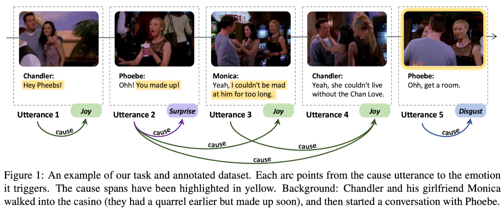
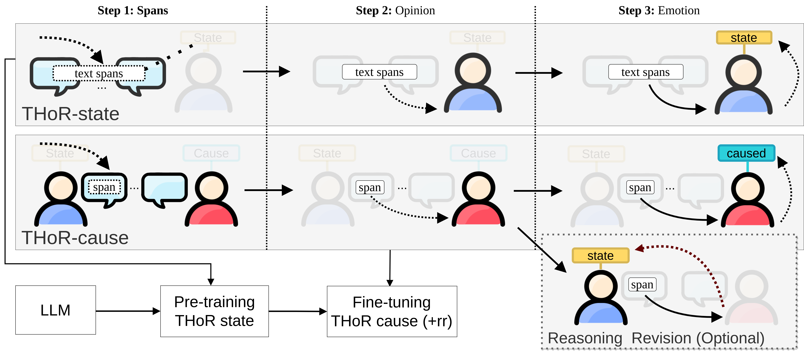

## THOR: Three-hop Reasoning for Emotion Cause Analysis in Context


**The PyTorch reforged and forked version of the official 
[THoR-framework](https://github.com/scofield7419/THOR-ISA),
enhanced
and adapted for SemEval-2024 paper 
[nicolay-r at SemEval-2024 Task 3.1: Reasoning Emotion Cause
Supported by Emotion State with Chain-of-Thoughts]()**

> **NOTE:** Since the existed fork aimed on a variety non-commercial projects application, 
> this repository represent **a copy** of the originally published code with the folllowing 
> [🔧 enhancements and changes](CHANGESET.md)

> **NOTE:** [List of the changes](CHANGESET.md) from the original THoR

## Contents
* [Overview](#overview)
* [**Quickstart**](#quickstart)
* [Usage](#code)
  * [Requirement](#requirement)
  * [Dataset Preparation](#data)
  * [**Prompts and CoT**](#prompts-and-engines)
  * [Training / Inferring](#runt5)
* [References](#references)  

## Overview<a name="overview" />

> Task Details.

<p align="center">
  
</p>

> Framework illustration.

<p align="center">
  
</p>

## Quickstart

We provide a [google-colab notebook]()
for downloading all the necessary data, followed by launching
experiments with `NVidia-V100`/ or `NVidia-A100`.


## Usage<a name="code" />

### Requirement<a name="requirement" />

``` bash 
pip install -r requirements.txt
```

### Datasets<a name="data" />

We provide `download_data.py` script for downloading all the necessary datasets (`D_state` and `D_cause`).

```python
python download_data.py \
  --cause-test "https://www.dropbox.com/scl/fi/4b2ouqdhgifqy3pmopq08/cause-mult-test.csv?rlkey=tkw0p1e01vezrjbou6v7qh36a&dl=1" \
  --cause-train "https://www.dropbox.com/scl/fi/0tlkwbe5awcss2qmihglf/cause-mult-train.csv?rlkey=x9on1ogzn5kigx7c32waudi21&dl=1" \
  --cause-valid "https://www.dropbox.com/scl/fi/8zjng2uyghbkpbfcogj6o/cause-mult-valid.csv?rlkey=91dgg4ly7p23e3id2230lqsoi&dl=1" \
  --state-train "https://www.dropbox.com/scl/fi/0lokgaeo973wo82ig01hy/state-mult-train.csv?rlkey=tkt1oyo8kwgqs6gp79jn5vbh8&dl=1" \
  --state-valid "https://www.dropbox.com/scl/fi/eu4yuk8n61izygnfncnbo/state-mult-valid.csv?rlkey=tlg8rac4ofkbl9o4ipq6dtyos&dl=1"
```

### LLMs<a name="llm" />
<a href="https://huggingface.co/docs/transformers/model_doc/flan-t5" rel="nofollow">
  
</a>

Use the **Flan-T5** as the backbone LLM reasoner:
  * [google/flan-t5-base](https://huggingface.co/google/flan-t5-base)
  * [google/flan-t5-large](https://huggingface.co/google/flan-t5-large)
  * [google/flan-t5-xl](https://huggingface.co/google/flan-t5-xl)
  * [google/flan-t5-xxl](https://huggingface.co/google/flan-t5-xxl)

### Prompts and Engines

We provide separate engines, and for each engine the source of the prompts in particular:
* `prompt_state`: 
  [instruction](https://github.com/nicolay-r/THOR-ECAC/blob/39b768cba5a652bc207725d707b5c41dece574ac/main.py#L143) 
  wrapped into the 
  [prompt](https://github.com/nicolay-r/THOR-ECAC/blob/39b768cba5a652bc207725d707b5c41dece574ac/src/utils.py#L9-L14)
* `prompt_cause`: 
  [instruction](https://github.com/nicolay-r/THOR-ECAC/blob/39b768cba5a652bc207725d707b5c41dece574ac/main.py#L142) 
  wrapped into the 
  [prompt](https://github.com/nicolay-r/THOR-ECAC/blob/39b768cba5a652bc207725d707b5c41dece574ac/src/utils.py#L9-L14)
* `thor_state`: [Class of the prompts](src/cot_state.py)
* `thor_cause`: [Class of the prompts](src/cot_cause.py)
* `thor_cause_rr`: [Class of the prompts](src/cot_cause.py) same as `thor_cause`

### Training and Evaluating with Flan-T5<a name="runt5" />

Use the [main.py](main.py) script with command-line arguments to run the 
**Flan-T5-based** THOR system. 


```bash
python main.py 
    -c <cuda_index> \
    -r [prompt|thor_state|thor_cause|thor_cause_rr]  \ 
    -d [state_se24|cause_se24] \
    -lf <path-to-the-pretrained-state \
    -es 10 \
    -bs 32 \
    -f <yaml_config> 
```

<details>
<summary>

### Parameters list
</summary>

* `-c`, `--cuda_index`: Index of the GPU to use for computation (default is 0).
* `-d`, `--data_name`: Name of the dataset. Choices are `state_se24` or `cause_se24`.
* `-r`, `--reasoning`: Specifies the reasoning mode, with one-step prompt or multi-step thor mode.
* `-f`, `--config`: Specifies the location of [config.yaml](config/config.yaml) file.
* `-li`, `--load_iter`: load a state on specific index from the same `data_name` resource (default `-1`, not applicable.)
* `-lp`, `--load_path`: load a state on specific path
* `-p`, `--instruct`: instructive prompt for `prompt` training engine that involves `target` parameter only"
* `-es`, `--epoch_size`: amount of training epochs (default: `1`)
* `-bs`, `--batch_size`: size of the batch (default: `None`)
* `-lr`, `--bert_lr`: learning rate (default=`2e-4`)
* `-t`, `--temperature`: temperature (default=gen_config.temperature)
* `-v`, `--validate`: running under zero-shot mode on `valid` set
* `-i`, `--infer_iter`: running inference on `test` dataset to form answers.

Configure more parameters in [config.yaml](config/config.yaml) file.

</details>

## References

The original THoR project:
```bibtex
@inproceedings{FeiAcl23THOR,
  title={Reasoning Implicit Sentiment with Chain-of-Thought Prompting},
  author={Hao, Fei and Bobo, Li and Qian, Liu and Lidong, Bing and Fei, Li and Tat-Seng, Chua},
  booktitle = "Proceedings of the Annual Meeting of the Association for Computational Linguistics",
  pages = "1171--1182",
  year={2023}
}
```

You can cite this work as follows:
```bibtex
TO-BE-ADDED
```

## Acknowledgement

This code is referred from following projects:
[CoT](https://arxiv.org/abs/2201.11903); 
[Flan-T5](https://huggingface.co/docs/transformers/model_doc/flan-t5);
[Transformers](https://github.com/huggingface/transformers),

## License

The code is released under Apache License 2.0 for Noncommercial use only. 
