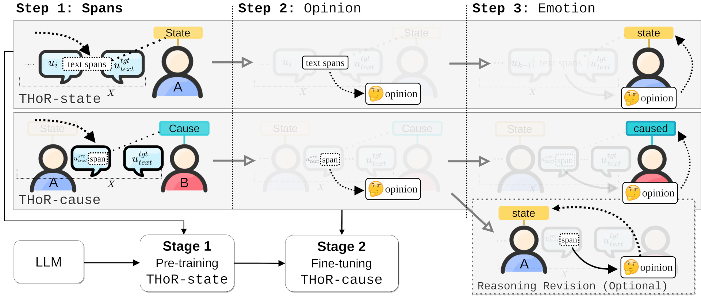

## THOR: Three-hop Reasoning for Emotion Cause Analysis in Context
<a href="https://huggingface.co/docs/transformers/model_doc/flan-t5" rel="nofollow">
  
</a>
<a href="https://huggingface.co/docs/transformers/index" rel="nofollow">
  
</a>
<a href="https://pytorch.org" rel="nofollow">
  
</a>


**The PyTorch reforged and forked version of the official 
[THoR-framework](https://github.com/scofield7419/THOR-ISA),
enhanced
and adapted for SemEval-2024 paper 
[nicolay-r at SemEval-2024 Task 3.1: Reasoning Emotion Cause
Supported by Emotion State with Chain-of-Thoughts]()**

> **NOTE:** Since the existed fork aimed on a variety non-commercial projects application, 
> this repository represent **a copy** of the originally published code with the folllowing 
> [enhancements and changes]()

> **NOTE:** List of the changes from the original THoR

## Quick Links
- [Overview](#overview)
- [Code Usage](#code)
  - [Requirement](#requirement)
  - [Dataset](#data)
- [References](#references)  

## Overview<a name="overview" />

> Task Details.

<p align="center">
  
</p>


> Framework illustration.

<p align="center">
  
</p>

## Code Usage<a name="code" />

### Requirement<a name="requirement" />

``` bash 
pip install -r requirements.txt
```

### Dataset<a name="data" />

> TO BE ADDED.

### LLMs<a name="llm" />

A. Use the Flan-T5 as the backbone LLM reasoner:
  - [google/flan-t5-base](https://huggingface.co/google/flan-t5-base),  
  - [google/flan-t5-large](https://huggingface.co/google/flan-t5-large), 
  - [google/flan-t5-xl](https://huggingface.co/google/flan-t5-xl),  
  - [google/flan-t5-xxl](https://huggingface.co/google/flan-t5-xxl),  

### Training and Evaluating with Flan-T5<a name="runt5" />

Use the [main.py](main.py) script with command-line arguments to run the 
**Flan-T5-based** THOR system. 


```bash
python main.py 
    -c <cuda_index> \
    -r [prompt|thor_state|thor_cause|thor_cause_rr]  \ 
    -d se24 \
    [-z] \
    -lf <path-to-the-pretrained-state \
    -es 10 \
    -bs 32 \
    -f <yaml_config> 
```
Some important arguments:

* `-c`, `--cuda_index`: Index of the GPU to use for computation (default is 0).
* `-d`, `--data_name`: Name of the dataset. Choices are 'restaurants' or 'laptops' (default is 'laptops').
* `-r`, `--reasoning`: Specifies the reasoning mode, with one-step prompt or multi-step thor mode (default is 'thor').
* `-z`, `--zero_shot`: If True, the system directly performs zero-shot prediction, otherwise run the fine-tuning on the train set (default is True).
* `-f`, `--config`: Specifies the location of [config.yaml](config/config.yaml) file.
* `-li`, `--load_iter`: load a state on specific index from the same `data_name` resource (default `-1`, not applicable.)
* `-lp`, `--load_path`: load a state on specific path
* `-p`, `--instruct`: instructive prompt for `prompt` training engine that involves `target` parameter only"
* `-es`, `--epoch_size`: amount of training epochs (default: `1`)
* `-bs`, `--batch_size`: size of the batch (default: `None`)
* `-lr`, `--bert_lr`: learning rate (default=`2e-4`)
* `-t`, `--temperature`: temperature (default=gen_config.temperature)
* `-v`, `--validate`: running under zero-shot mode on `valid` set
* `-i`, `--infer_iter`: running inference on `test` dataset to form answers.

Configurate more parameters in [config.yaml](config/config.yaml) file.


### References

The original THoR project:
```bibtex
@inproceedings{FeiAcl23THOR,
  title={Reasoning Implicit Sentiment with Chain-of-Thought Prompting},
  author={Hao, Fei and Bobo, Li and Qian, Liu and Lidong, Bing and Fei, Li and Tat-Seng, Chua},
  booktitle = "Proceedings of the Annual Meeting of the Association for Computational Linguistics",
  pages = "1171--1182",
  year={2023}
}
```

You can cite this work as follows:
```bibtex
TO-BE-ADDED
```

### Acknowledgement

This code is referred from following projects:
[CoT](https://arxiv.org/abs/2201.11903); 
[Flan-T5](https://huggingface.co/docs/transformers/model_doc/flan-t5);
[Transformers](https://github.com/huggingface/transformers),

### License

The code is released under Apache License 2.0 for Noncommercial use only. 
